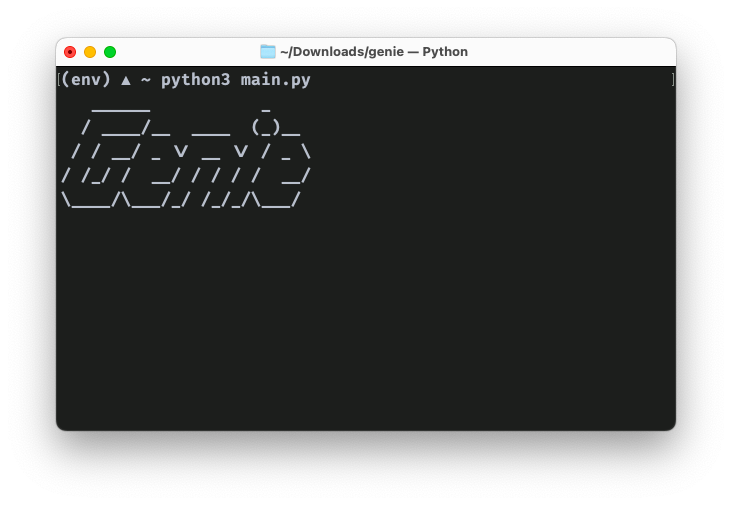

# Genie - Virtual Voice Assistant


## 🧞‍♂️ Introduction

(Kindly completely go through the README file before running the app.)

Genie is a Python-based voice assistant for your computer which can carry out a variety of tasks by employing certain well-defined commands. (See the **What can it do?** section below to know more)

Genie draws inspiration from the character "Genie" from the Disney Movie [Alladin](https://movies.disney.com/aladdin-2019). Genie runs in the background of your computer and wakes up whenever you wish so!

## 🏁 Getting Started - Prerequisites

You need to install Python 3.10/+ and pip installed on your computer first.

Also bear in mind, that Genie only works with an active internet connection.

Download the code as a zip or `git clone` it. Open the code in a Code Editor like VS Code, PyCharm etc. Create a file named **.env** in the folder. This file will contain private data like API Keys. Add the following content.

```
USER=YOUR_NAME_HERE
BOTNAME=Geni
NEWS_API_KEY=NONE
OPENWEATHER_APP_ID=NONE
TMDB_API_KEY=NONE
```

You will be replacing **NONE** with your values. To get the values, sign up for accounts on the following websites and get API Keys. Then, paste the API Keys into the respective API fields of the env file.

[NewsAPI](https://newsapi.org/)

[OpenWeatherMapAPI](https://openweathermap.org/)

[TMDB API](https://www.themoviedb.org/)

**Next, follow the installation instructions from the** [Installation README](Installation.md).

## 🔮 How do I use it?

Once you run the python file, you'll see a decor text. This indicates that Genie has turned on.



Now, you need to utter "Genie" to get it into listening mode. Once you utter the wake word, it will listen for your command. Refer to the **What can it do?** section below to see all the things it can do. After the command is given, it will process the command and speak the output. For commands that need a follow-up, you are expected to reply to the question it has; then it gives an output. 

As Genie is designed to run in the background, every time you want it to respond, you simply say "Genie" and it will say "Yes Boss", indicating you can proceed with your query.

Try it for yourself!

## 🚀 What can it do?

- **Open Desktop Applications**

  Format: open {name of the application}

  Currently defined: Notepad, Spotify, Terminal, Camera and Calculator

  Scroll down and have a look in the Installation readme to change app paths.

- **Take a screenshot**

  Format: Your query should include the word 'screenshot'.

- **Tell your IP Address**

  Format: Your query should include the word 'ip addrress'.

- **Type on the screen**

  Format: Your query should include the word 'type'.

- **Press the key 'Enter'**

  Format: Your query should include the phrase 'press enter'.

- **Shutdown your system**

  Format: Your query should include the phrase 'shutdown the computer'

- **Tell the time**

  Format: Your query should include the word 'time'

- **Tell the date**

  Format: Your query should include the word 'date'

- **Find on Wikipedia**

  Format: Your query should include the word 'wikipedia'

- **Search on YouTube**

  Format: Your query should include the word 'youtube'

- **Search on Google**

  Format: Your query should include the phrase 'search on google'

- **Send a WhatsApp Message**

  Make sure to have WhatsApp web logged into your default browser.

  Format: Your query should include the phrase 'send a whatsapp message'

- **Open Amazon Prime/Netflix/Hotstar**

  Format: Your query should include the word 'open' followed by any of the 3 platforms mentioned above

- **Tell a joke**

  Format: Your query should include the word 'joke'

- **Give an advice**

  Format: Your query should include the word 'advice'

- **Return and speak a list of the trending movies**

  Format: Your query should include the phrase 'trending movies'

- **Read the local news**

  Format: Your query should include the word 'news'

- **Tell the weather**

  Format: Your query should include the word 'weather'

- **COVID statistics**

  Format: Your query should include the word 'covid'

- **General queries like:**

  "Who are you?"

  "Who is your boss?"

  "What can you do?"

  "Who am I?"

  "Thank you."

- And last but not the least, you can say either exit or stop to well.. exit genie.

### 🤔 Why are there very less features? Will you add more features over time? Will this project be continued or is this a one-time side project?

Yes, most definitely! This is a side-project (not gonna be abandoned, though) I've made for myself to see where I stand in Python as a beginner. Now that I've gained confidence, I will add more features over time for you to enjoy ;)

## [](https://opensource.org/licenses/MIT) - View LICENSE.txt for more info

